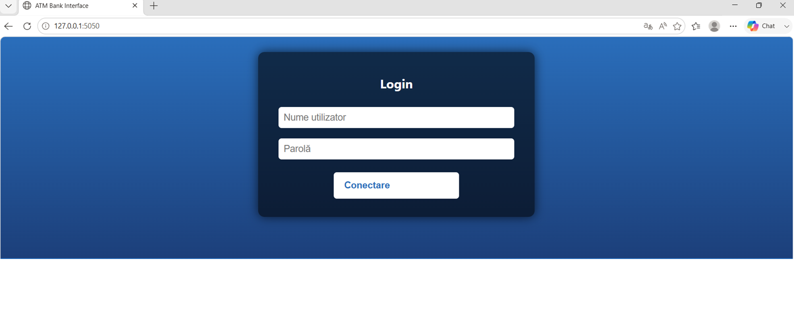
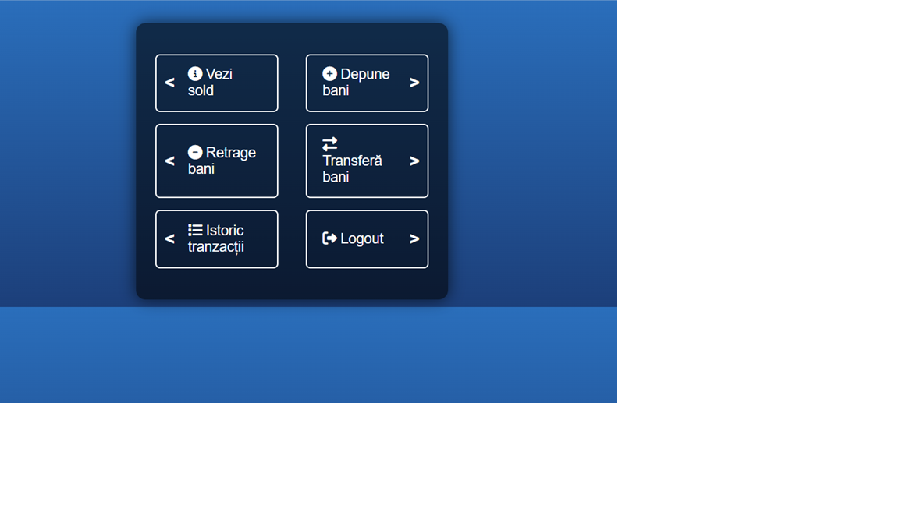
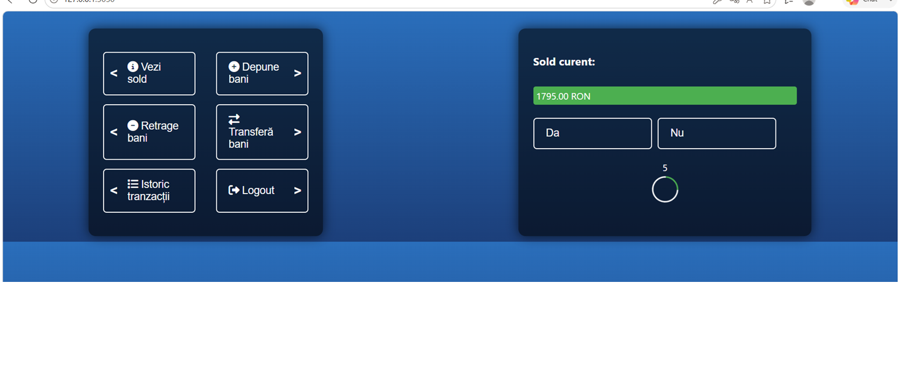
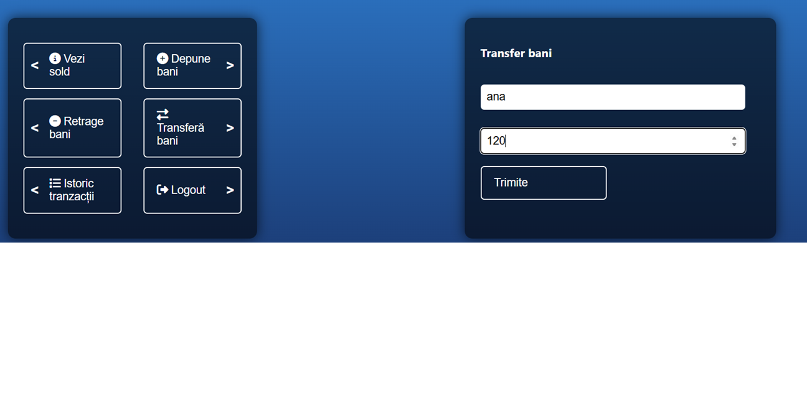
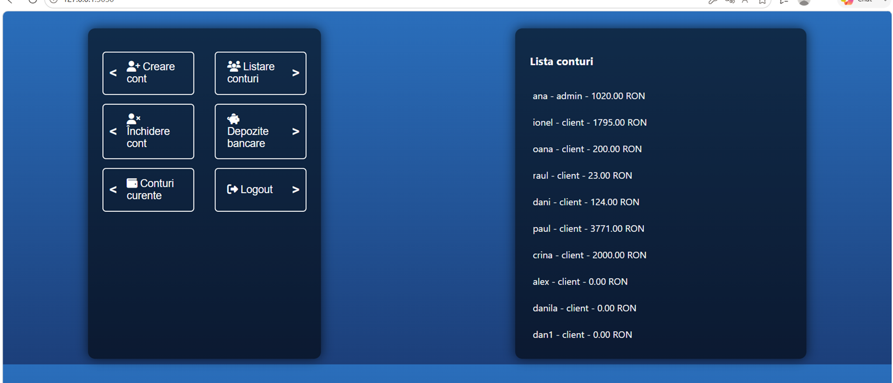

# ATM Banking System

A full-stack banking web application developed using **Flask**, **MySQL**, **HTML**, **CSS**, and **JavaScript**.

This project simulates the functionality of an Automated Teller Machine (ATM), allowing users to securely manage their bank accounts while providing administrators with account management capabilities.

---

# Screenshots

## Login



---

## User Dashboard



---

## Account Balance



---

## Money Transfer



---

## Administrator Dashboard



---

# Features

## Client

- Secure user authentication
- View account balance
- Deposit money
- Withdraw money
- Transfer money between accounts
- View transaction history

## Administrator

- Administrator authentication
- Create new bank accounts
- View all customer accounts
- Manage current and deposit accounts

---

# Technologies

## Backend

- Python
- Flask
- Flask-CORS
- MySQL Connector

## Frontend

- HTML5
- CSS3
- JavaScript

## Database

- MySQL

---

# Project Structure

```text
atm-banking-system/
│
├── images/
│   ├── atm-login.png
│   ├── atm-user-dashboard.png
│   ├── atm-admin-dashboard.png
│   ├── atm-transfer.png
│   └── atm-balance.png
│
├── templates/
│   └── index.html
│
├── app.py
├── database.sql
├── requirements.txt
├── .gitignore
└── README.md
```

---

# Installation

## Clone the repository

```bash
git clone https://github.com/alexiacoboni/atm-banking-system.git
```

## Navigate to the project directory

```bash
cd atm-banking-system
```

## Install the required packages

```bash
pip install -r requirements.txt
```

or

```bash
pip install flask flask-cors mysql-connector-python
```

## Create the database

Run the SQL script included in the repository.

```bash
mysql -u root -p < database.sql
```

or open MySQL Workbench and execute:

```sql
SOURCE database.sql;
```

## Configure the database connection

Update the database credentials inside `app.py`.

Example:

```python
return mysql.connector.connect(
    host="localhost",
    user="root",
    password="your_password",
    database="banca"
)
```

## Run the application

```bash
python app.py
```

The application will be available at:

```
http://localhost:5050
```

---

# Database

The application uses a MySQL database named **banca**.

The provided SQL script automatically:

- Creates the database
- Creates the required tables
- Inserts sample accounts
- Inserts sample transactions

Database tables:

- `conturi`
- `tranzactii`

---

# Security

The application implements several security measures, including:

- User authentication
- Administrator and client role separation
- SQL Injection protection using parameterized queries
- Server-side validation
- Input validation
- Error handling

---

# Future Improvements

- Password hashing using bcrypt
- User registration
- Password recovery
- JWT authentication
- REST API
- Docker support
- Responsive mobile interface
- PDF account statements
- Email notifications
- Transaction filtering and search

---

# Author

**Alex Iacoboni**

GitHub: https://github.com/alexiacoboni

---

# License

This project was developed for educational purposes as part of a university Software Engineering project.